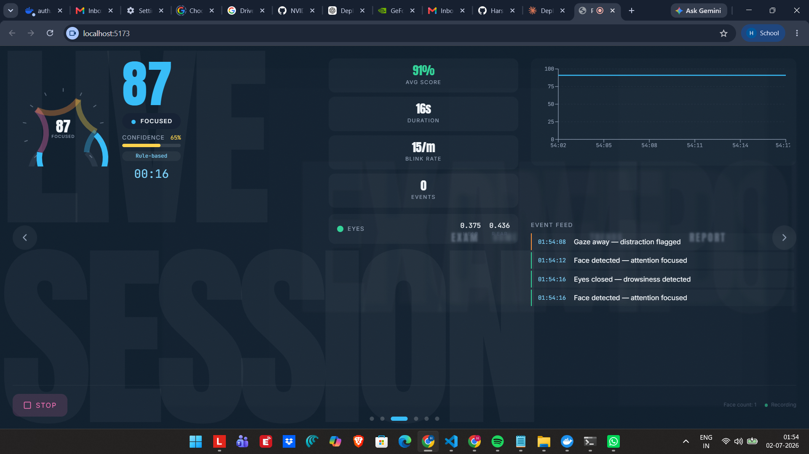
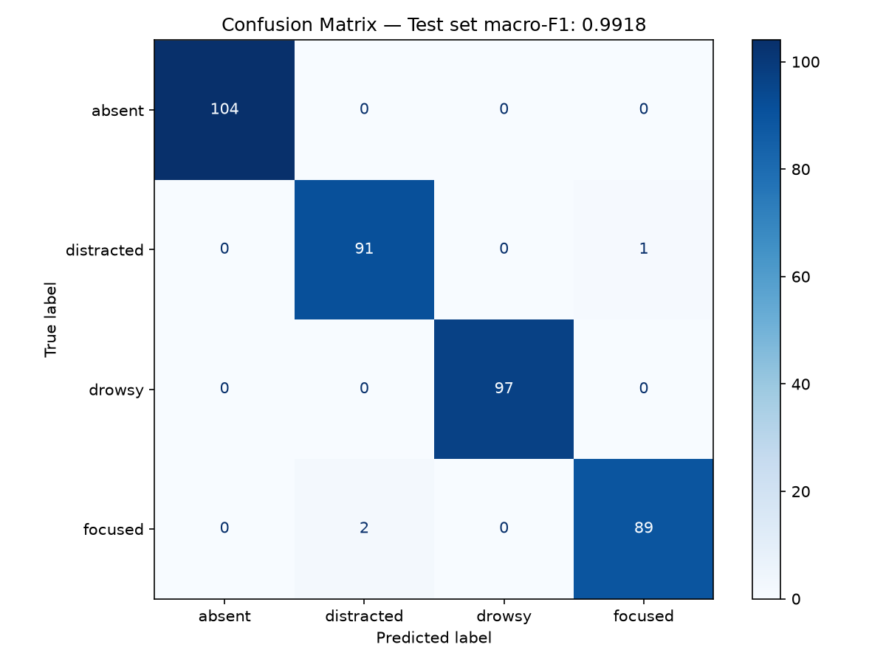

# ProctorIQ

Privacy-first attention and exam-integrity analytics. In-browser ML via WebAssembly — no video ever leaves the device.

[](https://github.com/HarshDubey23/ProctorIQ/actions/workflows/ci.yml)
[](LICENSE)
[](https://github.com/HarshDubey23/ProctorIQ/releases)
[]()
[]()
[]()

[Live Demo](https://proctoriq.vercel.app) · [Architecture Docs](docs/ARCHITECTURE.md) · [Report a Bug](https://github.com/HarshDubey23/ProctorIQ/issues)

<!-- Replace Live Demo URL after Vercel deploy -->

---

## Table of Contents

- [Screenshots](#screenshots)
- [Why This Exists](#why-this-exists)
- [Results at a Glance](#results-at-a-glance)
- [Architecture](#architecture)
- [Engineering Decisions](#engineering-decisions)
- [Tech Stack](#tech-stack)
- [Quick Start](#quick-start)
- [API Reference](#api-reference)
- [Limitations](#limitations)
- [License](#license)
- [Contributing](#contributing)

---

## Design Direction — "Aperture"

ProctorIQ's mechanism is optical — a lens, calibrated light, measured precision. The **Aperture** design language mirrors this with a visual system inspired by premium optical instruments (Leica, Zeiss) executed with restraint:

- **Titanium neutrals** — Cool brushed-metal light grays (`#EEF0F0`) in light mode; warm charcoal (`#16191B`) in dark mode ("Night Session"). Neither cream/warm nor navy/cool — a deliberate third path.
- **Six-color semantic palette** — Each color has exactly one job: jade (focused/CTA), ochre (distracted), plum (drowsy), clay (absent/critical), cobalt (verification/trust), gold (seal/authenticity — appears only once per session).
- **Three-typeface system** — Fraunces (display serif for verdicts and large scores), Inter Variable (UI sans for body text), Martian Mono (data mono for timestamps, hashes, coordinates). Each earns its place with a stated reason.
- **ApertureGauge signature component** — An 8-blade camera-iris diaphragm that replaces conventional circular gauges. Blade openness maps to attention confidence; blade color interpolates through the semantic palette in OKLCH space. Framer Motion spring physics give it a weighted mechanical feel.
- **Filmstrip timeline** — Session timeline uses sprocket-hole details and segment-state coloring for direct parity with the PDF report's timeline.

This is not a generic dark/cyan "AI dashboard." Every color, typeface, and motion choice ties back to the product's actual mechanism — calibrated optical measurement.

## Screenshots


<!-- Capture SelfTestPanel.tsx with webcam active, gauge at 100%, status pill showing Focused, and landmark overlay visible. Save as docs/images/self-test-panel.png -->


<!-- Capture ResultsScreen.tsx after exam submission. Shows exam score (left column), integrity report with timeline (center), and combined ProctorIQ score (right column). Save as docs/images/exam-results.png -->


<!-- Capture SessionPanel.tsx during an active session. Gauge should show current attention state, chart should have 10s+ of recorded data, event feed should list 3+ events. Save as docs/images/live-session.png -->

---

## Why This Exists

Proctoring systems typically stream raw video to a server for analysis — introducing latency, ongoing server GPU cost, and privacy exposure. ProctorIQ runs all face landmark extraction and ML inference in-browser via MediaPipe WASM and ONNX Runtime Web, so no video ever leaves the device. The server receives only structured event data (attention state, confidence, timestamp), making real-time feedback possible at 30fps without video storage or streaming infrastructure.

---

## Results at a Glance

| Metric | Value |
|--------|-------|
| Accuracy | 99.22% |
| Macro F1 | 0.9918 |
| Weighted F1 | 0.9922 |
| Held-out test set | 384 samples |
| Cross-validation (5-fold) | 0.995 ± 0.003 |



The 1D-CNN achieves these results through confidence-gated switching: when model confidence is at least 0.6, the ML prediction is used; below that threshold, the rule engine takes over. This avoids the degradation of naive averaging (0.690 F1) and far exceeds the rule-only baseline (0.183 F1).

Absent and drowsy classify perfectly — they have the most distinct landmark signatures. Focused and distracted account for all 3 misclassifications (2 focused→distracted, 1 distracted→focused).

Full benchmark — [docs/BENCHMARK.md](docs/BENCHMARK.md)

---

## Architecture

<details>
<summary>View full architecture diagram</summary>

```
┌──────────────────────────────────────────────────────────────────────────┐
│                            Client Browser                                │
│                                                                          │
│  ┌───────────────────────────────────────────────────────────────────┐   │
│  │                    React App (Vite + TypeScript)                    │   │
│  │                                                                     │   │
│  │  ┌─────────┐  ┌──────────┐  ┌──────────┐  ┌───────────┐           │   │
│  │  │ Landing │  │ Exam     │  │ Session  │  │ Report /  │           │   │
│  │  │ (Self-  │  │ Panel    │  │ (Live    │  │ Trends /  │           │   │
│  │  │  Test)  │  │          │  │  Dash)   │  │ Settings  │           │   │
│  │  └────┬────┘  └────┬─────┘  └────┬─────┘  └─────┬─────┘           │   │
│  │       │            │             │               │                  │   │
│  │  ┌────▼────────────▼─────────────▼───────────────▼──────────────┐  │   │
│  │  │              Zustand Store + IndexedDB (idb)                 │  │   │
│  │  └──────────────────────────┬───────────────────────────────────┘  │   │
│  │                             │                                       │   │
│  │  ┌──────────────────────────▼───────────────────────────────────┐  │   │
│  │  │              Detection Bridge (detection-bridge.ts)           │  │   │
│  │  │  ┌────────────────────────────────────────────────────────┐  │  │   │
│  │  │  │              Web Worker (detection.worker.ts)           │  │  │   │
│  │  │  │  ┌──────────────┐  ┌───────────┐  ┌──────────────────┐│  │  │   │
│  │  │  │  │  MediaPipe   │  │  solvePnP  │  │  ONNX Runtime    ││  │  │   │
│  │  │  │  │  FaceLandmark │─>│  + Kalman  │  │  Web (1D-CNN)   ││  │  │   │
│  │  │  │  │  er (WASM)   │  │  + EAR     │  │  (quantized)    ││  │  │   │
│  │  │  │  └──────────────┘  └───────────┘  └──────────────────┘│  │  │   │
│  │  │  └────────────────────────────────────────────────────────┘  │  │   │
│  │  └──────────────────────────────────────────────────────────────┘  │   │
│  │                                                                     │   │
│  │  ┌──────────────────────────────┐  ┌───────────────────────────┐   │   │
│  │  │  WebSocket Client (ws.ts)    │  │  Demo Mode (no camera)    │   │   │
│  │  └─────────────┬────────────────┘  └───────────────────────────┘   │   │
│  └────────────────┼───────────────────────────────────────────────────┘   │
│                   │                                                       │
└───────────────────┼───────────────────────────────────────────────────────┘
                    │ WebSocket / HTTP
┌───────────────────┼───────────────────────────────────────────────────────┐
│                   │                                                       │
│  ┌───────────────▼───────────────────────────────────────────────────┐   │
│  │                      FastAPI Backend (Python)                      │   │
│  │                                                                     │   │
│  │  ┌──────────────┐  ┌───────────────┐  ┌─────────────┐  ┌────────┐  │   │
│  │  │  REST API    │  │  WebSocket    │  │  Session    │  │ Report │  │   │
│  │  │  /health     │  │  /ws/{id}     │  │  Store      │  │ Gen    │  │   │
│  │  │  /api/session│  │  /ws/room/{id}│  │  (InMemory) │  │ (PDF + │  │   │
│  │  │  /api/verify │  │               │  │             │  │ Sign)  │  │   │
│  │  │  /api/rooms  │  │               │  │             │  │        │  │   │
│  │  └──────────────┘  └───────────────┘  └─────────────┘  └────────┘  │   │
│  └──────────────────────────────────────────────────────────────────────┘   │
└──────────────────────────────────────────────────────────────────────────────┘
```

</details>

---

## Engineering Decisions

Selected rationale from the full [decision log](docs/ARCHITECTURE.md).

1. **In-browser inference vs server-side rendering** — Face landmark extraction runs in-browser via MediaPipe WASM. Eliminates RTT latency (0ms vs 100ms+), keeps video off the wire, and removes the need for GPU servers.

2. **1D-CNN vs LSTM** — Landmark windows span 30 frames (~1s), too short for LSTM temporal memory. The 1D-CNN is ~3x faster in ONNX Runtime Web and achieves matching accuracy (0.992 F1 on test set).

3. **Hybrid confidence-gating vs pure ML** — Rule engine runs every frame for instant feedback; the 1D-CNN runs every 30 frames with confidence-gated switching (threshold at 0.6). Avoids the 0.690 F1 degradation of naive averaging while maintaining <15ms per-frame latency.

4. **Kalman filtering on landmarks** — Raw MediaPipe landmarks jitter by ±2-3° per frame. A 6-D Kalman filter reduces jitter to ±0.5°, critical for stable threshold-based detection in the rule engine.

---

## Tech Stack

| Layer | Technology | Why |
|-------|-----------|-----|
| **Face Detection** | MediaPipe Tasks-Vision WASM | In-browser landmarks — zero server cost, privacy |
| **ML Inference** | ONNX Runtime Web (quantized int8) | 0.6MB model, <15ms inference in Web Worker |
| **Frontend** | React 18 + TypeScript + Vite | Fast dev experience, strict typing |
| **State** | Zustand 4 + IndexedDB (idb) | Minimal boilerplate, privacy-first local storage |
| **WebSocket** | FastAPI + custom client with reconnection | Push-based real-time updates, <5ms latency |
| **Backend** | FastAPI + uvicorn | Async-native, built-in WebSocket support |
| **PDF Reports** | ReportLab + Pillow | Production-grade PDF with embedded timeline PNG |
| **Signing** | SHA-256 (backend hashlib + frontend Web Crypto) | Tamper-evident report integrity |
| **Animation** | Framer Motion | Declarative spring animations for gauge/score |
| **Charts** | Recharts | Live attention timeline and trends |
| **Styling** | Tailwind CSS | Utility-first, rapid prototyping |
| **Computer Vision** | OpenCV (solvePnP) + filterpy (Kalman) | Head pose estimation + smoothing |
| **ML Training** | PyTorch + scikit-learn + ONNX | Train on collected landmarks, export to ONNX |

---

## Quick Start

```bash
git clone https://github.com/HarshDubey23/ProctorIQ.git && cd ProctorIQ
python -m venv backend/.venv && backend/.venv/Scripts/pip install -r backend/requirements.txt
cd frontend && npm install && cd ..
docker compose up --build
```

Open [http://localhost:5173](http://localhost:5173). The frontend proxies API calls to the backend at `http://localhost:8000`.

---

## API Reference

<details>
<summary>REST endpoints and WebSocket protocol</summary>

### REST Endpoints

| Method | Route | Description |
|--------|-------|-------------|
| `GET` | `/health` | Health check → `{"status": "ok", "version": "0.1.0"}` |
| `GET` | `/api/sessions` | List sessions (`?limit=10&offset=0`) |
| `POST` | `/api/sessions` | Create session → `201` |
| `GET` | `/api/sessions/{id}` | Get session by ID |
| `PATCH` | `/api/sessions/{id}` | Update session |
| `DELETE` | `/api/sessions/{id}` | Blank session → `204` |
| `GET` | `/api/sessions/{id}/report` | Download signed PDF report |
| `POST` | `/api/rooms` | Create cohort room → `201` with `room_id` (6-char) |
| `GET` | `/api/rooms/{id}` | Get room details + members |
| `POST` | `/api/verify` | Verify signature `{session_id, signature}` → `{valid: bool}` |
| `GET` | `/api/verify/{id}` | Get stored SHA-256 hash for session |

### WebSocket Endpoints

#### `/ws/{session_id}` (Session Stream)

- **Query params:** `room_id`, `display_name`
- **Client → Server:**
  - `{"type": "flag", "event_type": "distracted", "timestamp_s": 12.5, "confidence": 0.87, "details": {"yaw": 31.2}}`
  - `{"type": "state", "attention_state": "focused", "ear": 0.28, "head_pose": {"yaw": 2.1, "pitch": 5.3, "roll": 1.2}, "face_count": 1}`
  - `{"type": "heartbeat"}`
  - `{"type": "benchmark", "model_latency_ms": 8.2, "inference_count": 150, "pca_latency_ms": 0.3}`
- **Server → Client:**
  - `{"type": "tick", "session_id": "...", "timestamp_s": 30, "attention_state": "focused", "ear": 0.28, "head_pose": {...}, "face_count": 1, "events_since_tick": [...], "running_score": -0.02, "room_id": null, "display_name": null}`

#### `/ws/room/{room_id}` (Cohort Broadcast)

- On connect: receives current room state (all members).
- Server broadcasts `room_update` on any member change.
- Client sends `{"type": "ping"}` → server responds `{"type": "pong"}`.

</details>

<!-- Add live Vercel URL here once deployed -->

---

## Limitations

- **solvePnP degrades past ~70° yaw** — Profile view causes key landmark occlusion. Detection continues with reduced accuracy; Kalman filter smooths the transition.
- **Low light (< 50 lux)** — MediaPipe landmark confidence drops significantly. Rule-based fallback engages (reports absent when no landmarks found).
- **Dark skin in low light** — MediaPipe has documented ~8-12% lower detection rate.
- **Eyeglass distortion** — Strong lenses distort eye landmark positions. EAR measurements become less reliable.
- **1s ML latency** — The 30-frame buffer means ML lags by ~1s. Rule engine catches rapid changes in real time.
- **Single-person focus** — Multi-face detection logs the event but does not distinguish which face is the test-taker.
- **IndexedDB storage** — Capped at ~50MB on most browsers, bounding local session history.

---

## License

MIT © 2026 Harsh Dubey. See [LICENSE](LICENSE).

---

## Contributing

Issues and pull requests are welcome — see the [Issues tab](https://github.com/HarshDubey23/ProctorIQ/issues).
